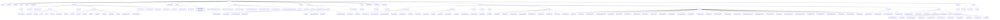

```mermaid
graph TD
    A[Zeurk/] --> B[.cursor/]
    A --> C[.firebaserc]
    A --> D[.gitignore]
    A --> E[.trae/]
    E --> E1[rules/]
    E1 --> E2[project_rules.md]
    A --> F[App.js]
    A --> G[app.config.js]
    A --> H[assets/]
    H --> H1[Zeurk.PNG]
    H --> H2[adaptive-icon.png]
    H --> H3[cars/]
    H3 --> H3_1[bluecars.png]
    H3 --> H3_2[ecd.png]
    H3 --> H3_3[f.png]
    H3 --> H3_4[j.png]
    H3 --> H3_5[luxe.png]
    H3 --> H3_6[motorbike.png]
    H3 --> H3_7[white.png]
    H --> H4[icon.png]
    H --> H5[icons/]
    H5 --> H5_1[Jet.png]
    H5 --> H5_2[Wait.png]
    H5 --> H5_3[airtel.jpg]
    H5 --> H5_4[flash.png]
    H5 --> H5_5[mpesa.png]
    H5 --> H5_6[orange.png]
    H5 --> H5_7[spacieux.png]
    H5 --> H5_8[vip.png]
    H --> H6[notification-icons/]
    H6 --> H6_1[notification-icon-24.png]
    H6 --> H6_2[notification-icon-48.png]
    H6 --> H6_3[notification-icon-96.png]
    H --> H7[notification-sounds/]
    H --> H8[splash-icon.png]
    A --> I[babel.config.js]
    A --> J[config/]
    J --> J1[ChatUI.expo.rules]
    J --> J2[firebase.json]
    J --> J3[firestore.indexes.json]
    J --> J4[firestore.rules]
    J --> J5[zeurk-be41b-firebase-adminsdk-fbsvc-674b2f596c.json]
    A --> K[docs/]
    K --> K1[APP_FIRST_WORKFLOW_COMPLETE.md]
    K --> K2[CONFIGURATION_COMPLETE.md]
    K --> K3[MATCHING_SYSTEM.md]
    K --> K4[OFFLINE_IMPLEMENTATION.md]
    K --> K5[SMS_NOTIFICATION_SETUP.md]
    K --> K6[SMS_SETUP_GUIDE.md]
    K --> K7[VEHICLE_REGISTRATION_CHECKLIST.md]
    A --> L[index.js]
    A --> M[ios/]
    M --> M1[.gitignore]
    M --> M2[.xcode.env]
    M --> M3[Podfile]
    M --> M4[Podfile.properties.json]
    M --> M5[Zeurk/]
    M5 --> M5_1[AppDelegate.swift]
    M5 --> M5_2[GoogleService-Info.plist]
    M5 --> M5_3[Images.xcassets/]
    M5 --> M5_4[Info.plist]
    M5 --> M5_5[SplashScreen.storyboard]
    M5 --> M5_6[Supporting/]
    M5 --> M5_7[Zeurk-Bridging-Header.h]
    M --> M6[Zeurk.xcodeproj/]
    M6 --> M6_1[project.pbxproj]
    M6 --> M6_2[xcshareddata/]
    A --> N[misc/]
    N --> N1[Hackaton]
    A --> O[package-lock.json]
    A --> P[package.json]
    A --> Q[root_scripts/]
    Q --> Q1[deploy.sh]
    Q --> Q2[server.js]
    A --> R[src/]
    R --> R1[components/]
    R1 --> R1_1[CategoryFilter.js]
    R1 --> R1_2[ChatMessageBubble.js]
    R1 --> R1_3[NetworkQualityIndicator.js]
    R1 --> R1_4[OfflineIndicator.js]
    R1 --> R1_5[RideOptionItem.js]
    R1 --> R1_6[SearchBar.js]
    R1 --> R1_7[VehicleCard.js]
    R --> R2[config/]
    R2 --> R2_1[designTokens.js]
    R2 --> R2_2[firebase.js]
    R2 --> R2_3[openrouter.js]
    R2 --> R2_4[productionConfig.js]
    R2 --> R2_5[smsConfig.js]
    R2 --> R2_6[vehicleMarketplace.js]
    R --> R3[context/]
    R3 --> R3_1[VehiclesContext.js]
    R --> R4[contexts/]
    R4 --> R4_1[AuthContext.js]
    R --> R5[data/]
    R5 --> R5_1[landmarks.js]
    R --> R6[hooks/]
    R6 --> R6_1[useFavorites.js]
    R6 --> R6_2[useLocation.js]
    R6 --> R6_3[useNetworkStatus.js]
    R6 --> R6_4[usePassengerAuth.js]
    R6 --> R6_5[useRequestQueue.js]
    R6 --> R6_6[useRideHistory.js]
    R6 --> R6_7[useUserProfile.js]
    R6 --> R6_8[useVehicles.js]
    R6 --> R6_9[usevehiclefilters.js]
    R --> R7[screens/]
    R7 --> R7_1[AuthScreen.js]
    R7 --> R7_2[ChatScreen.js]
    R7 --> R7_3[ConfirmPickupScreen.js]
    R7 --> R7_4[CreateVehicleListingScreen.js]
    R7 --> R7_5[DriverDashboard/]
    R7 --> R7_6[DriverLanding.js]
    R7 --> R7_7[EditProfileScreen.js]
    R7 --> R7_8[FindDriverScreen.js]
    R7 --> R7_9[HomeScreen.js]
    R7 --> R7_10[InfoChatScreen.js]
    R7 --> R7_11[InviteFriendScreen.js]
    R7 --> R7_12[NavigationScreen.js]
    R7 --> R7_13[PassengerAuthScreen.js]
    R7 --> R7_14[PaymentScreen.js]
    R7 --> R7_15[PreferencesScreen.js]
    R7 --> R7_16[ProfileScreen.js]
    R7 --> R7_17[ReportProblemScreen.js]
    R7 --> R7_18[RideHistoryScreen.js]
    R7 --> R7_19[RideOptionsScreen.js]
    R7 --> R7_20[RideOptionsScreenEnhanced.js]
    R7 --> R7_21[SMSRideRequestScreen.js]
    R7 --> R7_22[ScheduleRideScreen.js]
    R7 --> R7_23[SearchScreen.js]
    R7 --> R7_24[SuggestFeatureScreen.js]
    R7 --> R7_25[SupportAndAssistanceScreen.js]
    R7 --> R7_26[SupportChatScreen.js]
    R7 --> R7_27[VehicleDetailsScreen.js]
    R7 --> R7_28[VehicleMarketplaceScreen.js]
    R7 --> R7_29[WelcomeDriver.js]
    R7 --> R7_30[WelcomePassenger.js]
    R7 --> R7_31[WelcomeScreen.js]
    R --> R8[services/]
    R8 --> R8_1[driverTokenService.js]
    R8 --> R8_2[notificationService.js]
    R8 --> R8_3[productionCleanupService.js]
    R8 --> R8_4[rideMatchingService.js]
    R --> R9[utils/]
    R9 --> R9_1[driverAutoRegistration.js]
    R9 --> R9_2[locationService.js]
    R9 --> R9_3[networkManager.js]
    R9 --> R9_4[offlineStorage.js]
    R9 --> R9_5[requestQueue.js]
    R9 --> R9_6[scripts/]
    R9_6 --> R9_6_1[demo-matching-system.js]
    R9_6 --> R9_6_2[testMatching.js]
    R9_6 --> R9_6_3[validate-matching-system.js]
    R9_6 --> R9_6_4[add-drivers-admin.js]
    R9_6 --> R9_6_5[add-kinshasa-drivers.js]
    R9_6 --> R9_6_6[add-production-drivers.js]
    R9_6 --> R9_6_7[cleanup-test-data.js]
    R9_6 --> R9_6_8[configure-webhook.js]
    R9_6 --> R9_6_9[fix-missing-user.js]
    R9_6 --> R9_6_10[register-real-token.js]
    R9_6 --> R9_6_11[setup-twilio.js]
    A --> S[android/]
    S --> S1[app/]
    S1 --> S2[google-services.json]
    A --> T[api/]
    T --> T1[drivers.js]
    T --> T2[landmarks.js]
    T --> T3[sms.js]
```